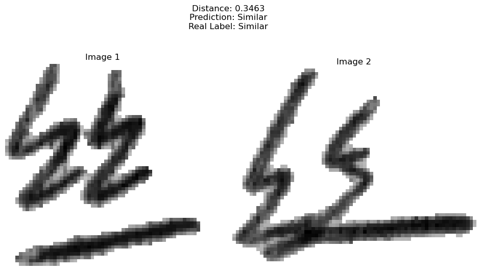
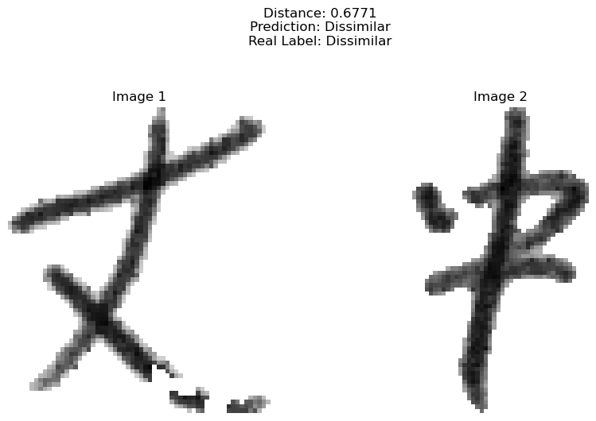
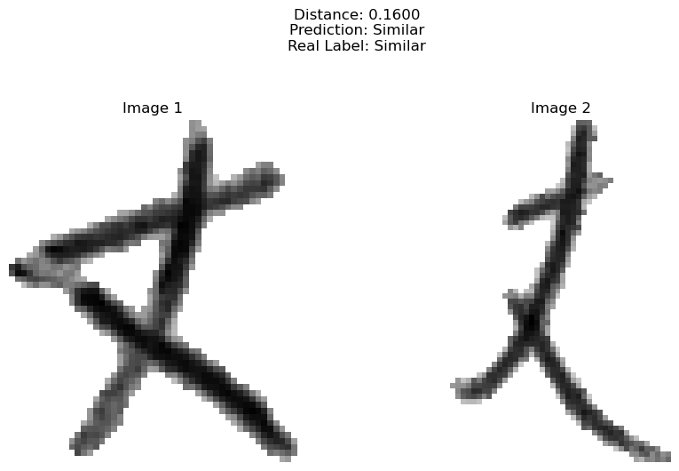
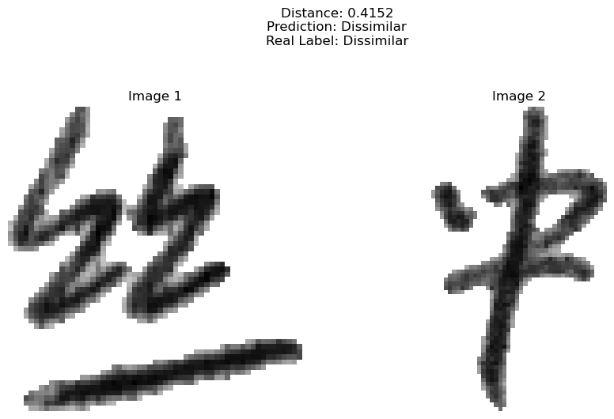

# Siamese Network Project

## Overview
This project implements two Siamese Network models for comparing handwritten character images (64x64, grayscale) based on the CASIA Handwritten Chinese Character Database. The models are designed to distinguish similar and dissimilar character pairs:

- `SiameseNetwork` (custom CNN)
- `EfficientNetSiameseNetwork` (based on EfficientNet-B0)

## Dataset
The project utilizes a custom dataset of handwritten Chinese character images, specifically designed for training and evaluating the Siamese Network models. Key details about the dataset include:

- **Source**: The dataset is derived from a collection of handwritten Chinese characters, preprocessed into 64x64 grayscale images. The HDF5 files containing the dataset can be downloaded from [this Google Drive link](https://drive.google.com/drive/folders/1kTcnoU773tdvbDB94knD6g8Ien8qMhHf).
- **Structure**: The dataset is split into three HDF5 files:
  - `train_pairs.h5`: Contains approximately 586,400 pairs of images for training, with labels indicating whether pairs are similar (1) or dissimilar (0).
  - `valid_pairs.h5`: Contains approximately 219,900 pairs for validation.
  - `test_pairs.h5`: Contains approximately 293,200 pairs for testing.
- **Format**: Each image is stored as a 64x64 grayscale array (1 channel), normalized to the range [0, 1]. Pairs are labeled as 1 (similar) or 0 (dissimilar) based on whether the characters in the images match.
- **Usage**: The dataset is loaded using a custom `SiameseDataset` class implemented in Python, enabling efficient batch processing with PyTorch DataLoader for training, validation, and testing.

## Directory Structure
- `data/`  
  Contains HDF5 datasets (downloadable at [this link](https://drive.google.com/drive/folders/1kTcnoU773tdvbDB94knD6g8Ien8qMhHf)) and test samples.
- `models/`  
  Contains model definitions and checkpoints.
- `scripts/`  
  Contains training and testing scripts.
- `utils/`  
  Contains utility functions (dataset, loss, helpers).
- `outputs/`  
  Contains logs and plots.

## Example Results

Below are example outputs from testing the two Siamese Network models on pairs of handwritten character images, showcasing both similar and dissimilar predictions.

### SiameseNetwork (Custom CNN)
- **Similar Pair**:  
    
  *Caption*: Distance: 0.3463, Prediction: Similar, Real Label: Similar.

- **Dissimilar Pair**:  
    
  *Caption*: Distance: 0.6771, Prediction: Dissimilar, Real Label: Dissimilar.

### EfficientNetSiameseNetwork (EfficientNet-B0)
- **Similar Pair**:  
    
  *Caption*: Distance: 0.16, Prediction: Similar, Real Label: Similar.

- **Dissimilar Pair**:  
    
  *Caption*: Distance: 0.4152, Prediction: Dissimilar, Real Label: Dissimilar.
